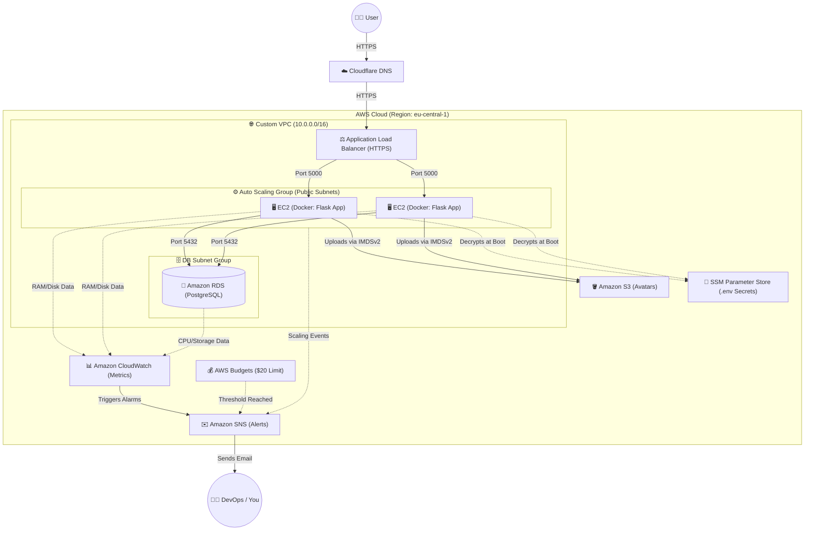

---

```markdown
# 🚀 ProTodo: Highly Available AWS Cloud Architecture & DevSecOps Pipeline


**ProTodo** is a production-grade, containerized Task Management application deployed on a highly available, self-healing AWS infrastructure. 

This project demonstrates modern Cloud Engineering and DevSecOps best practices. It features 100% Infrastructure as Code (IaC) via Terraform, automated vulnerability scanning, immutable infrastructure, zero-downtime SSM deployments, and rigorous secret management.

---

## 🏗️ Architecture Overview

The following diagram illustrates the flow of traffic, data, and automated monitoring across the AWS environment.



*[Insert an image of your ProTodo AWS Architecture Diagram here if you have a custom graphic]*

---

## ☁️ Cloud Infrastructure Deep Dive (100% Terraform)

The backbone of this project is a robust, custom-built AWS environment managed entirely via Terraform. Every component is designed with security, high availability, and scalability in mind.

### 1. Networking & Traffic Routing (VPC & ALB)

* **Custom VPC:** A dedicated VPC (`10.0.0.0/16`) hosting the entire architecture, isolating it from default AWS networks.
* **Multi-AZ Subnets:** Public subnets deployed across two distinct Availability Zones (`eu-central-1a` and `eu-central-1b`) to ensure High Availability (HA) for the Application Load Balancer.
* **Application Load Balancer (ALB):** Acts as the single point of entry. It terminates SSL/TLS connections using an **AWS ACM Certificate**, automatically redirects HTTP (Port 80) to HTTPS (Port 443), and forwards secure traffic to the EC2 instances on Port 5000.
* **Cloudflare DNS:** Custom domain routing is proxied through Cloudflare for an additional layer of DDoS protection and CDN caching.

### 2. Compute & High Availability (ASG & EC2)

* **Auto Scaling Group (ASG):** Configured to dynamically scale `t3.micro` instances in and out based on traffic.
* **Target Tracking Policy:** CloudWatch actively monitors `ASGAverageCPUUtilization`. If CPU usage crosses 50%, the ASG automatically provisions new servers to handle the load.
* **Launch Templates & IMDSv2:** Instances are provisioned using a standardized Launch Template running Ubuntu 22.04. The template enforces **IMDSv2** (Instance Metadata Service v2) requiring session tokens, protecting the servers from Server-Side Request Forgery (SSRF) attacks.

### 3. Secrets Management & Bootstrapping (SSM Parameter Store)

**No hardcoded secrets exist in this codebase.** Instead of baking sensitive database credentials or API keys into the Docker image or GitHub repository, the infrastructure utilizes dynamic secret injection:

* Production secrets are securely stored as encrypted strings in **AWS Systems Manager (SSM) Parameter Store**.
* During EC2 boot, the `script.sh` user-data script automatically installs the AWS CLI, authenticates using the instance's IAM role, and dynamically fetches the decrypted secrets via KMS.
* These secrets are written directly to a local `.env` file just seconds before `docker compose up` is executed, injecting them securely into the containers.

### 4. Database & Storage Layer (RDS & S3)

* **Amazon RDS (PostgreSQL 13):** A managed relational database provisioned within a dedicated DB Subnet Group. Automated backups and snapshots are enabled, and the instance is sized appropriately (`db.t3.micro`) for the application's workload.
* **Amazon S3 (Avatar Storage):** A dynamically generated S3 bucket is used for storing user profile pictures. The bucket is configured with strict Ownership Controls and a Public-Read bucket policy, allowing the web app to safely upload images while allowing users to view them instantly.

### 5. Security & IAM (Least Privilege)

* **Security Groups (Firewalls):** * `alb_sg`: Opens Ports 80 and 443 to the public internet (IPv4/IPv6).
* `app_sg`: EC2 instances **only** accept application traffic (Port 5000) if it originates from the ALB.
* `db_sg`: RDS **only** accepts database traffic (Port 5432) if it originates from the EC2 Security Group.


* **IAM Roles:** The EC2 instances operate under a strictly scoped IAM Instance Profile. Instead of dangerous "Full Access" policies, the instances only have permission to:
1. Write metrics to CloudWatch.
2. Communicate with SSM for zero-SSH deployments and secret fetching.
3. Perform `PutObject` and `GetObject` specifically targeting the `protodo-prod-storage` S3 ARN.


---

## 💻 The Application (ProTodo)

Sitting on top of this infrastructure is **ProTodo**, a fully containerized, full-stack web application designed for task management.

* **Frontend:** A responsive, lightweight UI built with HTML5, CSS3, and Vanilla JavaScript.
* **Backend:** A robust API built with **Python Flask**, served via the production-grade **Gunicorn** WSGI HTTP server.
* **Core Features:**
* **Authentication:** Secure user login and registration utilizing JWT (JSON Web Tokens).
* **Media Handling:** Direct, programmatic user avatar uploads to AWS S3 via the `boto3` SDK.
* **Notifications:** Automated email notification reminders integrated via the Sendinblue API.
* **Data Persistence:** Relational data mapping to the AWS RDS PostgreSQL backend.


---

## 🔒 DevSecOps CI/CD Pipeline

Deployment is fully automated via GitHub Actions (`deploy.yml`). It enforces a strict "Quality Gate" before any code reaches production.

*[Insert Screenshot of your green GitHub Actions Pipeline here]*

1. **Quality & Security Gate (All Branches):**
* **Flake8:** Python syntax and style enforcement.
* **Bandit:** Static Application Security Testing (SAST) to find common security issues.
* **Safety:** Scans `requirements.txt` for known vulnerable dependencies.
* **Pytest:** Automated unit testing logic.


2. **Build & Container Scan (Staging/Prod):**
* Builds the Docker image locally.
* **Trivy:** Scans the local image for OS and library vulnerabilities. The pipeline is configured to **fail immediately** if CRITICAL or HIGH vulnerabilities are detected.
* Pushes the secured image to DockerHub.


3. **Zero-SSH Deployment (Prod):**
* Utilizes **AWS SSM Send-Command** to trigger rolling updates on the EC2 instances remotely. This eliminates the need to open SSH Port 22 to the public internet or manage fragile SSH keys in GitHub. The pipeline remotely commands the servers to pull the latest image and restart the containers.


---

## 📊 Observability, Maintenance & FinOps

A production app isn't complete without monitoring and financial guardrails.

* **Deep EC2 Monitoring:** Installed the `amazon-cloudwatch-agent` via the bootstrap script to expose internal OS metrics (RAM and root volume Disk Space) that the default AWS hypervisor cannot see.
* **Proactive Alerting (SNS):** Terraform provisions CloudWatch Alarms to send immediate email notifications for:
* RDS Storage running critically low (<2GB) or RAM dropping below 256MB.
* EC2 Disk Space exceeding 80% or Memory exceeding 70%.
* ASG Scaling events (Instance launches/terminations).


* **Automated Maintenance:** The EC2 `script.sh` injects a root cronjob that runs `docker system prune -af --filter "until=24h"` every day at **3:00 AM**. This automatically cleans up old, unused Docker images after deployments, preventing the EC2 root volume from filling up and crashing the server.
* **FinOps (AWS Budgets):** Configured a strict **AWS Budgets** alarm via Terraform to monitor monthly spend. If the automated infrastructure costs reach 100% of the $20 limit, it instantly triggers an email alert, preventing surprise cloud bills.

*[Insert Screenshot of CloudWatch Alarms or AWS Budgets here]*

---

## 📂 Codebase Structure

```text
├── .github/workflows
│   └── deploy.yml          # DevSecOps CI/CD Pipeline
├── backend/
│   ├── app.py              # Flask Application Entrypoint
│   └── requirements.txt    # Python Dependencies (boto3, flask, etc.)
├── frontend/               # HTML/CSS/JS Assets
├── Dockerfile              # Multi-stage optimized Docker build
├── docker-compose.yml      # Container orchestration
└── terraform/
    ├── vpc.tf              # Custom VPC, Subnets, Route Tables
    ├── alb.tf              # Load Balancer & Target Groups
    ├── asg.tf              # Auto Scaling & Launch Templates
    ├── rds.tf              # PostgreSQL Database Setup
    ├── s3.tf               # Object Storage & Public Access Policies
    ├── security.tf         # Security Groups (Firewall rules)
    ├── iam.tf              # IAM Roles & Least-Privilege Policies
    ├── cloudwatch.tf       # Monitoring & SNS Alarms
    ├── billing.tf          # AWS Budgets & Cost Management
    ├── script.sh           # EC2 User Data Bootstrap & SSM fetching
    ├── variables.tf        # Environment Variables
    └── terraform.tfvars    # Core Configuration Values

```

---

## 🚧 Roadblocks & Technical Deep Dives

Building a production-ready environment is rarely straightforward. Here are two major technical challenges encountered during this deployment and how they were engineered away:

### 1. The "Ghost" Credentials: S3 Uploads Failing Inside Docker (IMDSv2 vs. Hop Limits)

**The Symptom:** The Flask application worked perfectly locally, but once deployed to the EC2 instances via Docker, user avatar uploads to S3 failed continuously with an `Unable to locate credentials` error. This happened despite the EC2 instance having the correct IAM Role (`s3:PutObject`) attached.

**The Root Cause:** To harden the infrastructure against Server-Side Request Forgery (SSRF) attacks, the EC2 Launch Template was strictly configured to require **IMDSv2** (`http_tokens = "required"`).
However, Docker containers run on their own isolated virtual network bridge (`docker0`). When the `boto3` library inside the container tried to request the secure IMDSv2 token from the EC2 metadata IP (`169.254.169.254`), the request had to jump from the container network to the host network. Because the default AWS metadata response has a Time-To-Live (TTL) "hop limit" of exactly `1`, the return packet was dropped by the network before it could reach the container.

**The Fix:**

1. **Network Layer:** Updated the Terraform `aws_launch_template` to explicitly set `http_put_response_hop_limit = 3`. This allowed the metadata token packets to survive the extra routing hops across the Docker bridge.
2. **Application Layer:** Removed strict, outdated `boto3` version pinning in `requirements.txt` to ensure the container pulled the latest AWS SDK capable of natively negotiating the IMDSv2 protocol.

### 2. The IAM Illusion: S3 "AccessDenied" Despite Full Admin Rights

**The Symptom:** After fixing the container credential issue, the application successfully contacted S3 but was immediately hit with an `AccessDenied` exception when attempting to upload the `.jpg` profile pictures.

**The Root Cause:** The Python application was passing `ACL='public-read'` in the `boto3.put_object()` call so that frontend users could actually view their uploaded avatars. However, in recent years, AWS radically shifted its default S3 security posture. Modern S3 buckets are created with **"Block Public Access"** turned on globally, and Object ACLs disabled by default. Even though the EC2 IAM Role had absolute `s3:*` permissions, the bucket-level security protocols forcefully blocked the upload because the code requested a public ACL.

**The Fix:**
Instead of fighting the AWS security defaults manually in the console, the entire S3 security posture was refactored in Terraform (`s3.tf`):

1. **Bucket Ownership Controls:** Explicitly configured `aws_s3_bucket_ownership_controls` to `BucketOwnerPreferred` to re-enable ACL processing.
2. **Public Access Block:** Overrode the default lockdown by setting `block_public_acls = false` inside the `aws_s3_bucket_public_access_block` resource.
3. **Least-Privilege IAM:** Stripped the dangerous `AmazonS3FullAccess` policy from the EC2 instance and replaced it with a highly scoped inline IAM policy that only allows `PutObject`, `PutObjectAcl`, and `GetObject` strictly within the `protodo-prod-storage` bucket ARN.

```

```